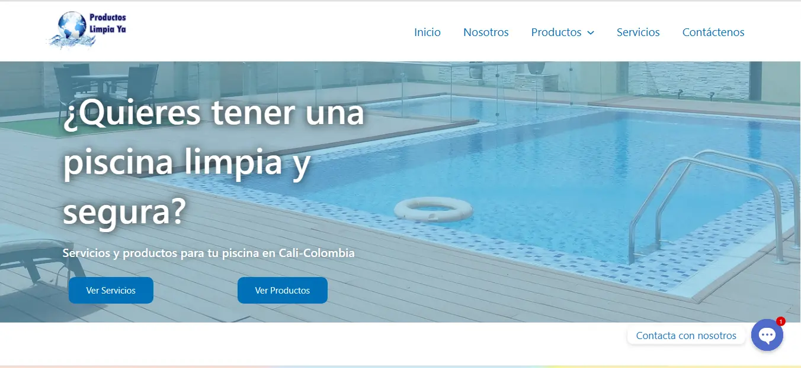

### 👉 Sobre mi

Tecnólogo en Sistemas de Información con una pasión por el desarrollo web. Actualmente, estoy estudiando para expandir mis habilidades y conocimientos.

Me considero una persona creativa, analítica y orientada a los detalles, con la capacidad de diseñar y desarrollar soluciones web efectivas y atractivas. Estoy buscando una oportunidad para aplicar mis habilidades y experiencia como Desarrollador Web en un entorno desafiante y dinámico.

### 📋 Intereses

- 🔭 Estoy actualmente buscando empleo de forma remota
- 🌱 Estoy estudiando FullStack MERN | Tecnologia en analisis y desarollo de software
- 👯 Quiero colaborar en el Front end y Back end

### 📝 Habilidades

### 📝 Portafolio

### ✉️ Contactame

 
