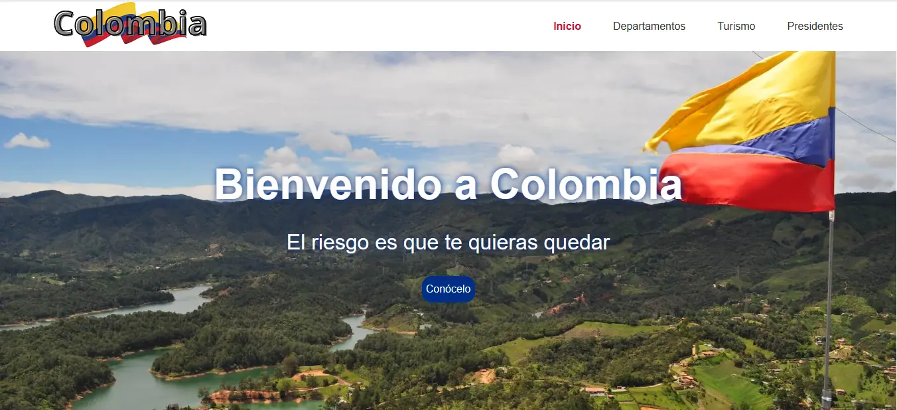

## 👉 Sobre mi

Tecnólogo en Sistemas de Información con una pasión por el desarrollo web. Actualmente estoy estudiando, tecnología en análisis y desarrollo de software en el SENA, para expandir mis habilidades y conocimientos.

Poseo una sólida capacidad para trabajar en equipo y comunicarme de manera efectiva. Siempre estoy dispuesto a aprender y mantenerme actualizado sobre las últimas tendencias y avances en el desarrollo web.

## 🔧 Habilidades

- Desarrollo web front-end: HTML, CSS, JavaScript y React.
- Experiencia en diseño responsive.
- Conocimientos en bases de datos relacionales: PostgreSQL y no relacionales: MongoDB.
- Conocimientos en lenguajes de programación back-end: NodeJS, PHP y TypeScript.
- Control de versiones con Git.
- Excelentes habilidades de comunicación y trabajo en equipo.

## 📝 Portafolio

<a href='https://alejo170.github.io/bookstore/' title="MERNbooks" target='_blank'>
<kbd>
  
</kbd>
</a>

<a href='https://colombia-19kqo6m3z-alejo170.vercel.app/' title="Colombia" target='_blank'>
<kbd>
  
</kbd>
</a>

## ✉️ Contactame

 
